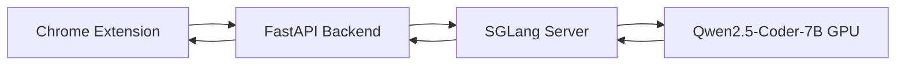
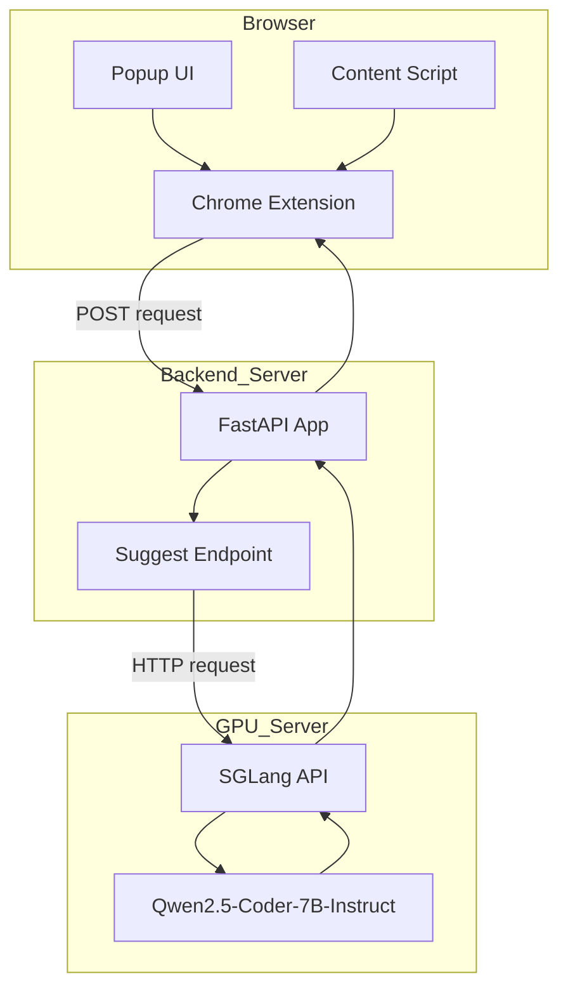
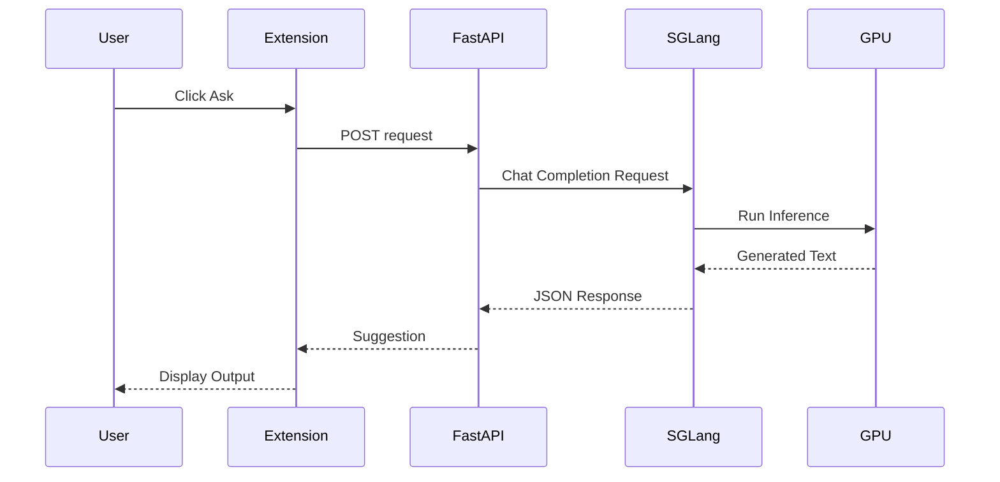

# Canvas Coding Assistant  
### Qwen on GPU · FastAPI Backend · Chrome Extension


An AI-powered coding assistant that runs **Qwen2.5-Coder-7B-Instruct** on a GPU server and integrates directly into Canvas through a Chrome extension.

The extension sends prompts to a FastAPI backend, which forwards them to a GPU-hosted Qwen model via SGLang, then returns suggestions back to the browser.

---

# 🧱 System Architecture

## High-Level Architecture



---

## Detailed Component Architecture



---

# 🔄 Request Lifecycle



---

# 📂 Repository Structure

```
canvas-coding-assistant/
│
├── backend/
│   ├── main.py
│   ├── requirements.txt
│
├── extension/
│   ├── manifest.json
│   ├── popup.html
│   ├── popup.js
│   ├── popup.css
│   └── content.js
│
└── README.md
```

---

# ⚙️ Tech Stack

| Layer | Technology |
|-------|------------|
| Model | Qwen2.5-Coder-7B-Instruct |
| Inference Engine | SGLang |
| Backend | FastAPI |
| Frontend | Chrome Extension (Manifest v3) |
| GPU | NVIDIA RTX 4090 |
| Transport | REST (OpenAI-compatible API) |

---

# 🚀 Running the System

## 1️⃣ Start SGLang

```bash
python -m sglang.launch_server \
  --model-path "<path-to-model>" \
  --host 127.0.0.1 \
  --port 30000
```

## 2️⃣ Start FastAPI Backend

```bash
uvicorn main:app --host 127.0.0.1 --port 8000
```

Test:

```bash
curl http://127.0.0.1:8000/health
```

---

# 🔒 Security & Confidentiality

For security reasons:

- No internal IP addresses are exposed
- No usernames or SSH credentials are included
- No absolute filesystem paths are documented
- Backend is designed to run behind localhost or a secure tunnel
- CORS policies should be restricted in production
- HTTPS and authentication should be added before deployment

---

# 🎯 Vision

This project aims to evolve into:

- A context-aware AI coding tutor  
- A Canvas-integrated grading assistant  
- A memory-enabled LLM agent system  
- A scalable GPU-backed AI infrastructure  
