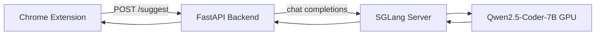
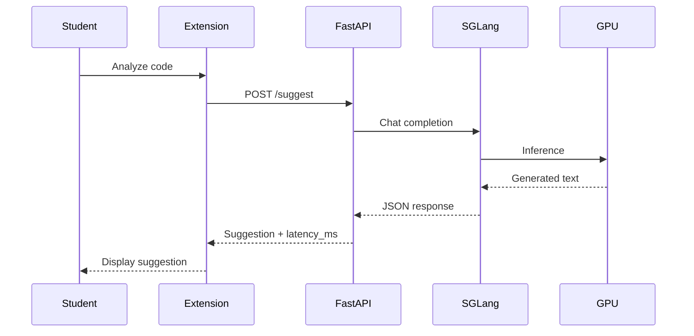

# Canvas Coding Assistant

> Production LLM coding assistant for Canvas LMS — Qwen2.5-Coder-7B on GPU, serving 100+ active users at the University of Houston.


<p align="center">
  
</p>

## Overview

Canvas Coding Assistant is an AI-powered coding helper integrated into the University of Houston's Canvas LMS workflow. A Chrome extension captures code from OneCompiler assignments, sends it to a FastAPI backend, and returns a single actionable suggestion generated by **Qwen2.5-Coder-7B-Instruct** running on GPU via SGLang.

Built as part of my Research Assistant role at UH, the system is in active production use across introductory programming courses.

## Impact

- **100+ active users** in production across UH programming courses
- **GPU-hosted inference** via SGLang on Qwen2.5-Coder-7B-Instruct
- **Chrome extension** embedded directly in the student coding workflow (OneCompiler + Canvas)
- **Structured request logging** — prompt size, platform, language, and latency tracked per request

## Architecture


```mermaid
flowchart LR
    Ext[Chrome Extension] -->|POST /suggest| API[FastAPI Backend]
    API -->|chat completions| SGL[SGLang Server]
    SGL --> GPU[Qwen2.5-Coder-7B GPU]
    GPU --> SGL
    SGL --> API
    API --> Ext
```


```mermaid
sequenceDiagram
    participant Student
    participant Extension
    participant FastAPI
    participant SGLang
    participant GPU

    Student->>Extension: Analyze code
    Extension->>FastAPI: POST /suggest
    FastAPI->>SGLang: Chat completion
    SGLang->>GPU: Inference
    GPU-->>SGLang: Generated text
    SGLang-->>FastAPI: JSON response
    FastAPI-->>Extension: Suggestion + latency_ms
    Extension-->>Student: Display suggestion
```

## Tech Stack

| Layer | Technology |
|---|---|
| Model | Qwen2.5-Coder-7B-Instruct |
| Inference | SGLang (OpenAI-compatible API) |
| Backend | FastAPI, Python 3.10+ |
| Client | Chrome Extension (Manifest V3) |
| Transport | REST |

## Quick Start

### 1. Start SGLang

```bash
python -m sglang.launch_server \
  --model-path Qwen/Qwen2.5-Coder-7B-Instruct \
  --host 127.0.0.1 \
  --port 30000
```

### 2. Configure the backend

```bash
cd backend
python -m venv .venv && source .venv/bin/activate
pip install -r requirements.txt
cp ../.env.example ../.env   # edit MODEL_ID / SGLANG_BASE_URL if needed
```

### 3. Start FastAPI

```bash
uvicorn main:app --host 127.0.0.1 --port 8000 --reload
```

Verify:

```bash
curl http://127.0.0.1:8000/health
```

### 4. Load the Chrome extension

1. Open `chrome://extensions`
2. Enable **Developer mode**
3. Click **Load unpacked** and select the `extension/` directory
4. Navigate to a OneCompiler page and use the extension popup to analyze code

## Project Structure

```
canvas-coding-assistant/
├── backend/
│   ├── main.py              # FastAPI app + /suggest endpoint
│   └── requirements.txt
├── extension/
│   ├── manifest.json        # Manifest V3
│   ├── content.js           # Code extraction from OneCompiler
│   ├── popup.html/js        # Extension popup UI
│   └── inject.js
├── docs/
│   └── architecture.svg     # Architecture diagram
├── .env.example
├── LICENSE
└── README.md
```

## Configuration

| Variable | Default | Description |
|---|---|---|
| `SGLANG_BASE_URL` | `http://127.0.0.1:30000` | SGLang OpenAI-compatible API base URL |
| `MODEL_ID` | `Qwen/Qwen2.5-Coder-7B-Instruct` | Hugging Face model identifier |
| `CORS_ORIGINS` | `*` | Comma-separated allowed origins (restrict in production) |

## Security Notes

- **Development only:** default `CORS_ORIGINS=*` allows any origin — restrict to your extension origin before production deployment.
- **No secrets in repo:** use `.env` for configuration; never commit credentials or internal paths.
- **Production hardening:** add HTTPS termination, authentication on `/suggest`, and rate limiting before public exposure.

## Author

**Jyotiradityasinh Chauhan**

[Portfolio](https://portfolio-pink-mu-c2p7srhcva.vercel.app) · [LinkedIn](https://linkedin.com/in/jyotiradityasinh-chauhan) · [GitHub](https://github.com/jaychauhan1)
